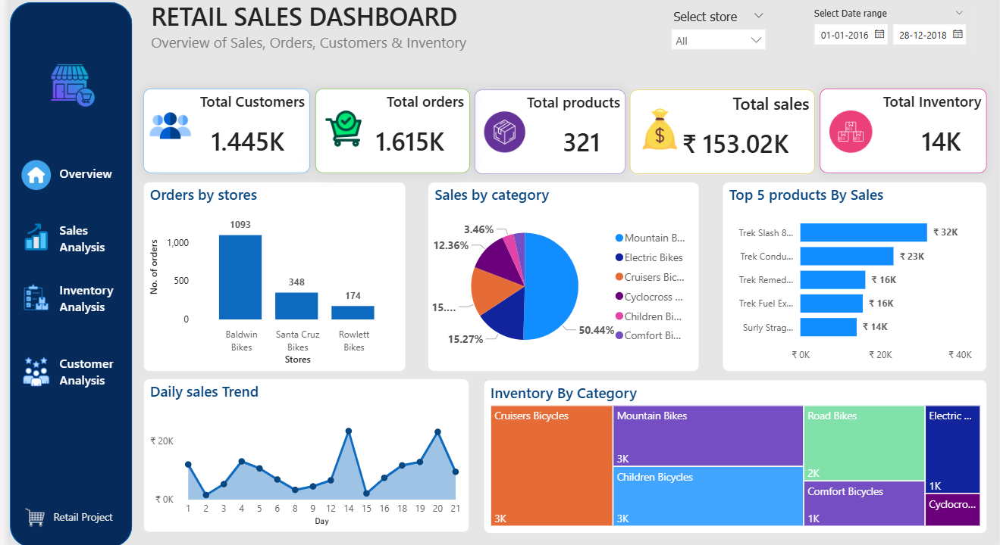
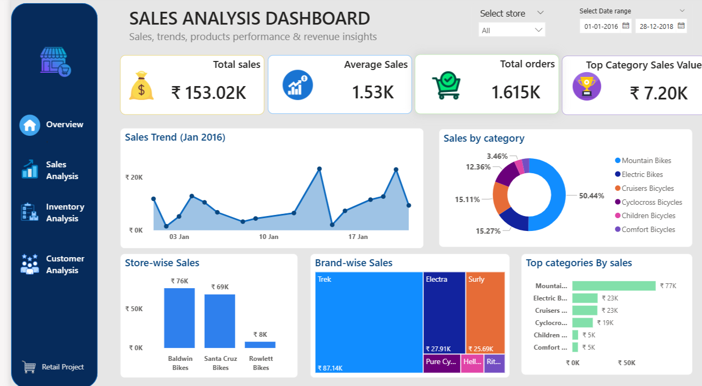
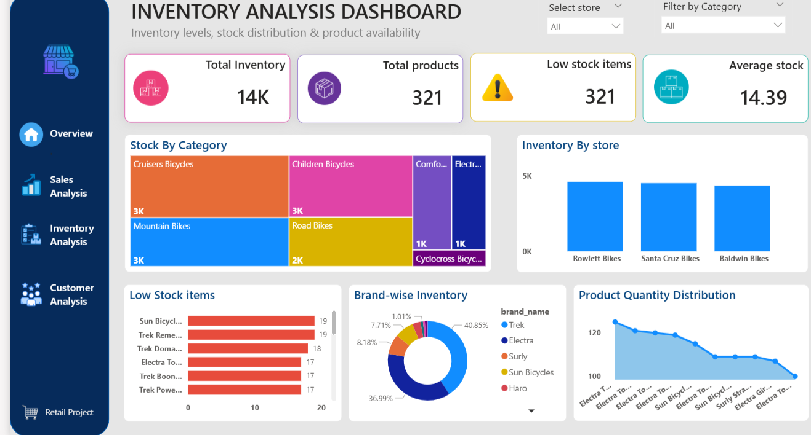
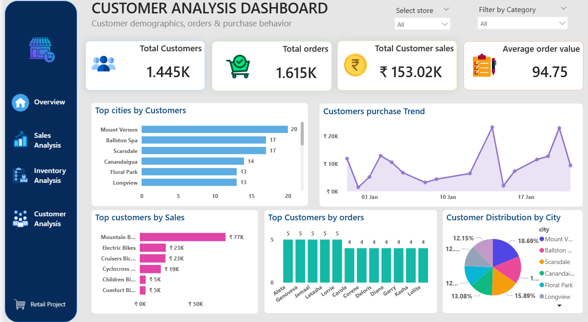

# Retail_Sales_&_Inventory_Intelligence_Analysis_Dashboard

Project Overview
This project focuses on analyzing retail sales, inventory, customer behavior, and store performance using Excel, SQL, and Power BI.
The main objective of this project is to help businesses make data-driven decisions by identifying sales trends, top-performing products, customer insights, and inventory management issues.

Business Problem
Retail businesses often face challenges such as:
- Identifying top-performing products and stores
- Managing low-stock inventory items
- Understanding customer purchasing behavior
- Tracking sales performance and trends
-  Improving operational and inventory efficiency

This project aims to solve these problems through interactive dashboards and data analysis.
Project Objectives
- Analyze overall sales performance
- Identify top-selling products and categories
- Monitor inventory levels and low-stock items
- Analyze customer purchase behavior
- Compare store-wise performance
- Generate business insights for better decision-making

Tools Used
- Microsoft Excel (Data Cleaning)
- MySQL (Database Creation & SQL Queries)
- Power BI (Dashboard & Visualization)
  
Data Cleaning Process (Excel)
- Removed duplicate records
- Handled missing/null values
- Standardized column formats
- Corrected inconsistent data entries
- Cleaned and organized datasets for analysis

SQL Process
- Created retail sales database in MySQL
- Imported cleaned datasets into SQL tables
- Applied primary and foreign key relationships
- Executed SQL queries for business analysis
- Connected SQL database with Power BI using ODBC connector

Business Insights
- Mountain Bikes generated the highest sales revenue.
- Baldwin Bikes store performed best among all stores.
- Trek brand contributed the highest sales and inventory share.
- Some products showed low stock levels and require restocking.
- Customer purchases showed peak sales during mid and late month periods.

Business Recommendations
- Increase inventory for high-demand products.
- Improve sales strategies for low-performing stores.
- Maintain stock monitoring system for low-stock products.
- Focus marketing campaigns on top-performing categories.
- Enhance customer retention strategies using customer purchase behavior.

Future Scope
- Add real-time sales tracking
- 

Project Deliverables
- Cleaned Excel Dataset
- SQL Database File
- Power BI Dashboard
- Business Analysis Report

Dashboards
- Overview Dashboard

- Sales Analysis Dashboard

- Inventory Analysis Dashboard

- Customer Analysis Dashboard

Author
 
Anshika Bhati
